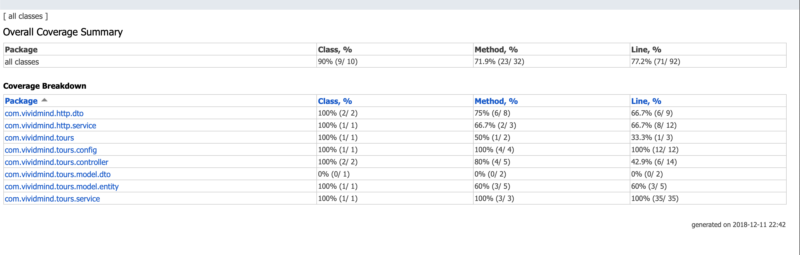

# Spring Backend

### Tech

* Java
* Maven
* Spring Boot

### Installation

Install the dependencies and devDependencies and start the server.

```sh
$ git clone {github_url}
$ cd project
$ mvn clean project
$ java -jar web/target/web-0.0.1-SNAPSHOT.war
$ now server running default port 8080
```

### Testing
```
$ Get Tours
$ curl --user john12:john12 -X GET http://localhost:8080/tours
$ curl --user john12:john12 -X GET http://localhost:8080/tours?filter
$ curl --user john12:john12 -X GET http://localhost:8080/tours?filter=history

$ Refresh Tours
$ curl --user admin12:admin12 -H 'Content-Type: application/json' -X POST http://localhost:8080/tours/refresh -d '{"filter":null}'
$ curl --user admin12:admin12 -H 'Content-Type: application/json' -X POST http://localhost:8080/tours/refresh -d '{"filter":"history"}'
```

### Coverage Report
 - Reports attached under **Reports** directory

 